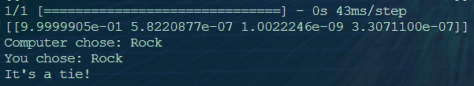

# Computer Vision RPS

## Milestone 1: Set up the environment

First thing starting this project was to setup and clone the Github repo, which was an easy task, as we done the same already in the previous project "Hangman".

## Milestone 2: Create the computer vision system

Creating the computer vision system was a a breeze using [Teachable Machine](https://teachablemachine.withgoogle.com/), which provides a simple way to record your data and train a deep learning model. Using our webcam, we recorded around 500 photos for each class (Rock, Paper, Scissors, Nothing), that were used to train the computer vision model.

After training was finished, we downloaded the model as "keras_model.h5" and "labels.txt" into the local repository and commit and push the changes to Github.

## Milestone 3: Install the dependencies

Before running the program, we need to install the dependencies. We will set up a virtual environment and install opencv-python, tensorflow, and ipykernel using pip install.

## Milestone 4: Create a Rock-Paper-Scissors game

## Task 1: Store the user's and computer's choices

This code needs to randomly choose an option (rock, paper, or scissors) and then ask the user for an input.

Create another file called manual_rps.py that will be used to play the game without the camera.

You will need to use the random module to pick a random option between rock, paper, and scissors and the input function to get the user's choice.

Create two functions: get_computer_choice and get_user_choice.

The first function will randomly pick an option between "Rock", "Paper", and "Scissors" and return the choice.

The second function will ask the user for an input and return it.

```python
import random

def get_computer_choice():
    moves = ["Rock", "Paper", "Scissors"]
    computer_choice =  random.choice(moves)
    return computer_choice

def get_user_choice():
    user_choice = input("Please choose Rock, Paper or Scissors: ")
    return user_choice
```

### Task 2: Figure out who won

Using if-elif-else statements, the script should now choose a winner based on the classic rules of Rock-Paper-Scissors.

For example, if the computer chooses rock and the user chooses scissors, the computer wins.

Wrap the code in a function called get_winner and return the winner.

This function takes two arguments: computer_choice and user_choice.

If the computer wins, the function should print "You lost", if the user wins, the function should print "You won!", and if it's a tie, the function should print "It is a tie!".

```python
import random

def get_computer_choice():
    moves = ["Rock", "Paper", "Scissors"]
    computer_choice =  random.choice(moves)
    return computer_choice

def get_user_choice():
    user_choice = input("Please choose Rock, Paper or Scissors: ")
    return user_choice

def get_winner(computer_choice, user_choice):
    if computer_choice == "Rock" and user_choice == "Paper":
        print("You won!")
    elif computer_choice == "Rock" and user_choice == "Scissors":
        print("You lost!")
    elif computer_choice == "Paper" and user_choice == "Rock":
        print("You lost!")
    elif computer_choice == "Paper" and user_choice == "Scissors":
        print("You won!")
    elif computer_choice == "Scissors" and user_choice == "Rock":
        print("You won!")
    elif computer_choice == "Scissors" and user_choice == "Paper":
        print("You lost!")
    elif computer_choice == user_choice:
        print("It's a tie!")
```

### Task 3: Create a function to simulate the game

All of the code you've programmed so far relates to one thing: running the game - so you should wrap it all in one function.

Create and call a new function called play.
Inside the function you will call all the other three functions you've created (get_computer_choice, get_user_choice, and get_winner)

Now when you run the code, it should play a game of Rock-Paper-Scissors, and it should print whether the computer or you won.

```python
import random

def play():
    def get_computer_choice():
        moves = ["Rock", "Paper", "Scissors"]
        computer_choice =  random.choice(moves)
        return computer_choice

    def get_user_choice():
        user_choice = input("Please choose Rock, Paper or Scissors: ")
        return user_choice

    def get_winner(computer_choice, user_choice):
        if computer_choice == "Rock" and user_choice == "Paper":
            print("You won!")
        elif computer_choice == "Rock" and user_choice == "Scissors":
            print("You lost!")
        elif computer_choice == "Paper" and user_choice == "Rock":
            print("You lost!")
        elif computer_choice == "Paper" and user_choice == "Scissors":
            print("You won!")
        elif computer_choice == "Scissors" and user_choice == "Rock":
            print("You won!")
        elif computer_choice == "Scissors" and user_choice == "Paper":
            print("You lost!")
        elif computer_choice == user_choice:
            print("It's a tie!")

    get_winner(get_computer_choice(), get_user_choice())

play()
```

## Milestone 5: Use the camera to play Rock-Paper-Scissors

### Task 1: Putting all together

Replace the hard-coded user guess with the output of the computer vision model. Create a new file called camera_rps.py where you will write the new code.

Create a new function called get_prediction that will return the output of the model you used earlier.

Remember that the output of the model you downloaded is a list of probabilities for each class. You need to pick the class with the highest probability. So, for example, assuming you trained the model in this order: "Rock", "Paper", "Scissors", and "Nothing", if the first element of the list is 0.8, the second element is 0.1, the third element is 0.05, and the fourth element is 0.05, then, the model predicts that you showed "Rock" to the camera with a confidence of 0.8.

The model can make many predictions at once if given many images. In your case you only give it one image at a time. That means that the first element in the list returned from the model is a list of probabilities for the four different classes. Print the response of the model if you are unclear of this.

```python
from RPS_Template import prediction
import numpy as np
import random

def play():
    def get_computer_choice():
        moves = ["Rock", "Paper", "Scissors"]
        computer_choice =  random.choice(moves)
        print(f"Computer chose: {computer_choice}")
        return computer_choice

    def get_prediction():
        with open('labels.txt', 'r') as f:
            # Read the lines of the file and strip the newline characters
            lines = [line.strip() for line in f.readlines()]
        # Create an empty dictionary to store the indices and labels 
        labels = {}
        # Loop through the lines and split them into key-value pairs
        for line in lines:
            idx, label = line.split()
            labels[int(idx)] = label
        index = np.argmax(prediction)
        #confidence_score = prediction[0][index]
        print(f"You chose: {labels[index]}")
        return labels[index]

    def get_winner(comp, user):
        if comp == "Rock" and user == "Paper":
            print("You won!")
        elif comp == "Rock" and user == "Scissors":
            print("You lost!")
        elif comp == "Paper" and user == "Rock":
            print("You lost!")
        elif comp == "Paper" and user == "Scissors":
            print("You won!")
        elif comp == "Scissors" and user == "Rock":
            print("You won!")
        elif comp == "Scissors" and user == "Paper":
            print("You lost!")
        else:
            print("It's a tie!")

    comp = get_computer_choice()
    user = get_prediction()
    get_winner(comp, user)

play()
```



### Task 2: Count down
