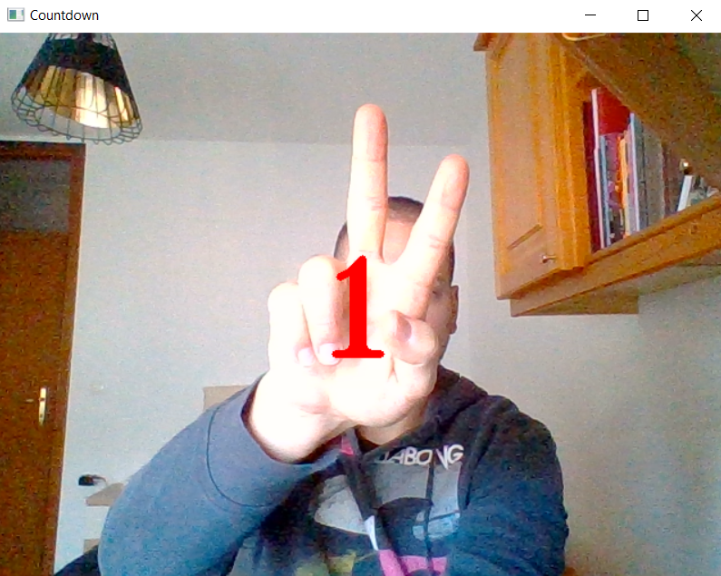
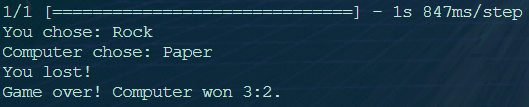

# Computer Vision RPS

## Milestone 1: Set up the environment

First thing starting this project was to setup and clone the Github repo, which was an easy task, as we done the same already in the previous project "Hangman".

## Milestone 2: Create the computer vision system

Creating the computer vision system was a a breeze using [Teachable Machine](https://teachablemachine.withgoogle.com/), which provides a simple way to record your data and train a deep learning model. Using our webcam, we recorded around 500 photos for each class (Rock, Paper, Scissors, Nothing), that were used to train the computer vision model.

After training was finished, we downloaded the model as "keras_model.h5" and "labels.txt" into the local repository and commit and push the changes to Github.

## Milestone 3: Install the dependencies

Before running the program, we need to install the dependencies. We will set up a virtual environment and install opencv-python, tensorflow, and ipykernel using pip install.

## Milestone 4: Create a Rock-Paper-Scissors game

## Task 1: Store the user's and computer's choices

This code needs to randomly choose an option (rock, paper, or scissors) and then ask the user for an input.

Create another file called manual_rps.py that will be used to play the game without the camera.

You will need to use the random module to pick a random option between rock, paper, and scissors and the input function to get the user's choice.

Create two functions: get_computer_choice and get_user_choice.

The first function will randomly pick an option between "Rock", "Paper", and "Scissors" and return the choice.

The second function will ask the user for an input and return it.

```python
import random

def get_computer_choice():
    moves = ["Rock", "Paper", "Scissors"]
    computer_choice =  random.choice(moves)
    return computer_choice

def get_user_choice():
    user_choice = input("Please choose Rock, Paper or Scissors: ")
    return user_choice
```

### Task 2: Figure out who won

Using if-elif-else statements, the script should now choose a winner based on the classic rules of Rock-Paper-Scissors.

For example, if the computer chooses rock and the user chooses scissors, the computer wins.

Wrap the code in a function called get_winner and return the winner.

This function takes two arguments: computer_choice and user_choice.

If the computer wins, the function should print "You lost", if the user wins, the function should print "You won!", and if it's a tie, the function should print "It is a tie!".

```python
import random

def get_computer_choice():
    moves = ["Rock", "Paper", "Scissors"]
    computer_choice =  random.choice(moves)
    return computer_choice

def get_user_choice():
    user_choice = input("Please choose Rock, Paper or Scissors: ")
    return user_choice

def get_winner(comp, user):
    if comp == "Rock" and user == "Paper":
        print("You won!")
    elif comp == "Rock" and user == "Scissors":
        print("You lost!")
    elif comp == "Paper" and user == "Rock":
        print("You lost!")
    elif comp == "Paper" and user == "Scissors":
        print("You won!")
    elif comp == "Scissors" and user == "Rock":
        print("You won!")
    elif comp == "Scissors" and user == "Paper":
        print("You lost!")
    else:
        print("It's a tie!")
```

### Task 3: Create a function to simulate the game

All of the code you've programmed so far relates to one thing: running the game - so you should wrap it all in one function.

Create and call a new function called play.
Inside the function you will call all the other three functions you've created (get_computer_choice, get_user_choice, and get_winner)

Now when you run the code, it should play a game of Rock-Paper-Scissors, and it should print whether the computer or you won.

```python
import random

def play():
    def get_computer_choice():
        moves = ["Rock", "Paper", "Scissors"]
        computer_choice =  random.choice(moves)
        return computer_choice

    def get_user_choice():
        user_choice = input("Please choose Rock, Paper or Scissors: ")
        return user_choice

    def get_winner(comp, user):
        if comp == "Rock" and user == "Paper":
            print("You won!")
        elif comp == "Rock" and user == "Scissors":
            print("You lost!")
        elif comp == "Paper" and user == "Rock":
            print("You lost!")
        elif comp == "Paper" and user == "Scissors":
            print("You won!")
        elif comp == "Scissors" and user == "Rock":
            print("You won!")
        elif comp == "Scissors" and user == "Paper":
            print("You lost!")
        else:
            print("It's a tie!")

    comp = get_computer_choice()
    user = get_prediction()
    get_winner(comp, user)

play()
```

## Milestone 5: Use the camera to play Rock-Paper-Scissors

### Task 1: Putting all together

Replace the hard-coded user guess with the output of the computer vision model. Create a new file called camera_rps.py where you will write the new code.

Create a new function called get_prediction that will return the output of the model you used earlier.

Remember that the output of the model you downloaded is a list of probabilities for each class. You need to pick the class with the highest probability. So, for example, assuming you trained the model in this order: "Rock", "Paper", "Scissors", and "Nothing", if the first element of the list is 0.8, the second element is 0.1, the third element is 0.05, and the fourth element is 0.05, then, the model predicts that you showed "Rock" to the camera with a confidence of 0.8.

The model can make many predictions at once if given many images. In your case you only give it one image at a time. That means that the first element in the list returned from the model is a list of probabilities for the four different classes. Print the response of the model if you are unclear of this.

```python
from RPS_Template import prediction
import numpy as np
import random

def play():
    def get_computer_choice():
        moves = ["Rock", "Paper", "Scissors"]
        computer_choice =  random.choice(moves)
        print(f"Computer chose: {computer_choice}")
        return computer_choice

    def get_prediction():
        with open('labels.txt', 'r') as f:
            # Read the lines of the file and strip the newline characters
            lines = [line.strip() for line in f.readlines()]
        # Create an empty dictionary to store the indices and labels 
        labels = {}
        # Loop through the lines and split them into key-value pairs
        for line in lines:
            idx, label = line.split()
            labels[int(idx)] = label
        index = np.argmax(prediction)
        #confidence_score = prediction[0][index]
        print(f"You chose: {labels[index]}")
        return labels[index]

    def get_winner(comp, user):
        if comp == "Rock" and user == "Paper":
            print("You won!")
        elif comp == "Rock" and user == "Scissors":
            print("You lost!")
        elif comp == "Paper" and user == "Rock":
            print("You lost!")
        elif comp == "Paper" and user == "Scissors":
            print("You won!")
        elif comp == "Scissors" and user == "Rock":
            print("You won!")
        elif comp == "Scissors" and user == "Paper":
            print("You lost!")
        else:
            print("It's a tie!")

    comp = get_computer_choice()
    user = get_prediction()
    get_winner(comp, user)

play()
```


### Task 2: Count down

Here we add a count down over the camera feed and the model predicts on the final frame when count down reaches zero. I updated the RPS_Template.py and saved the new code in RPS_countdown.py.

```python
import cv2
from keras.models import load_model
import numpy as np

model = load_model('keras_model_mat_2_day_night.h5')
cap = cv2.VideoCapture(0)
data = np.ndarray(shape=(1, 224, 224, 3), dtype=np.float32)

# Define countdown animation function
def countdown_animation(frame, seconds_left):
    # Draw countdown text on the frame
    font = cv2.FONT_HERSHEY_SIMPLEX
    text = str(seconds_left)
    textsize = cv2.getTextSize(text, font, 4, 5)[0]
    text_x = int((frame.shape[1] - textsize[0]) / 2)
    text_y = int((frame.shape[0] + textsize[1]) / 2)
    cv2.putText(frame, text, (text_x, text_y), font, 4, (0, 0, 255), 5)

# Set countdown timer
countdown_time = 5  # seconds
start_time = cv2.getTickCount() / cv2.getTickFrequency()

# Start countdown
while True:
    # Capture a frame from the camera
    ret, frame = cap.read()
    # Check if frame was successfully captured
    if not ret:
        print("Unable to capture frame")
        break
    # Calculate time elapsed
    time_elapsed = (cv2.getTickCount() / cv2.getTickFrequency()) - start_time
    # Check if countdown has finished
    if time_elapsed >= countdown_time:
        break
    # Display countdown animation
    countdown_animation(frame, countdown_time - int(time_elapsed))
    # Display the frame
    cv2.imshow("Countdown", frame)
    # Wait for a key press
    key = cv2.waitKey(1)
    if key == ord('q'):
        break

# Capture final frame
ret, frame = cap.read()
# Check if frame was successfully captured
if not ret:
    print("Unable to capture frame")
# Resize and normalize image
resized_frame = cv2.resize(frame, (224, 224), interpolation=cv2.INTER_AREA)
image_np = np.array(resized_frame)
normalized_image = (image_np.astype(np.float32) / 127.0) - 1 # Normalize the image
data[0] = normalized_image
# Predict on final frame
prediction = model.predict(data)
# Release the capture and destroy all windows
cv2.waitKey(500)
cap.release()
cv2.destroyAllWindows()
```



### Task 3: Repeat until a player gets three victories

At this stage we need to combine the two pieces of code: RPS-countdown and camera_rps. This is needed so that the RPS-countdown script runs anew inside play() function for every round of the game. After user or computer reaches 3 wins, the game is over and the final result is displayed on the screen.

```python
import numpy as np
import random
import cv2
from keras.models import load_model

def play():
    global computer_wins
    global user_wins
    computer_wins = 0
    user_wins = 0
    
    def get_computer_choice():
        moves = ["Rock", "Paper", "Scissors"]
        computer_choice =  random.choice(moves)
        print(f"Computer chose: {computer_choice}")
        return computer_choice

    def get_prediction():
        model = load_model('keras_model_mat_2_day_night.h5')
        with open('labels.txt', 'r') as f:
            # Read the lines of the file and strip the newline characters
            lines = [line.strip() for line in f.readlines()]
        # Create an empty dictionary to store the indices and labels 
        labels = {}
        # Loop through the lines and split them into key-value pairs
        for line in lines:
            idx, label = line.split()
            labels[int(idx)] = label
        
        cap = cv2.VideoCapture(0)
        data = np.ndarray(shape=(1, 224, 224, 3), dtype=np.float32)

        # Define countdown animation function
        def countdown_animation(frame, seconds_left):
            # Draw countdown text on the frame
            font = cv2.FONT_HERSHEY_TRIPLEX
            text = str(seconds_left)
            textsize = cv2.getTextSize(text, font, 4, 5)[0]
            text_x = int((frame.shape[1] - textsize[0]) / 2)
            text_y = int((frame.shape[0] + textsize[1]) / 2)
            cv2.putText(frame, text, (text_x, text_y), font, 4, (0, 0, 255), 5)

        # Set countdown timer
        countdown_time = 5  # seconds
        start_time = cv2.getTickCount() / cv2.getTickFrequency()

        # Start countdown
        while True:
            # Capture a frame from the camera
            ret, frame = cap.read()
            # Check if frame was successfully captured
            if not ret:
                print("Unable to capture frame")
                break
            # Calculate time elapsed
            time_elapsed = (cv2.getTickCount() / cv2.getTickFrequency()) - start_time
            # Check if countdown has finished
            if time_elapsed >= countdown_time:
                break
            # Display countdown animation
            countdown_animation(frame, countdown_time - int(time_elapsed))
            # Display the frame
            cv2.imshow("Countdown", frame)
            # Wait for a key press
            key = cv2.waitKey(1)
            if key == ord('q'):
                break

        # Capture final frame
        ret, frame = cap.read()
        # Check if frame was successfully captured
        if not ret:
            print("Unable to capture frame")
        # Resize and normalize image
        resized_frame = cv2.resize(frame, (224, 224), interpolation=cv2.INTER_AREA)
        image_np = np.array(resized_frame)
        normalized_image = (image_np.astype(np.float32) / 127.0) - 1 # Normalize the image
        data[0] = normalized_image
        # Predict on final frame
        prediction = model.predict(data)
        index = np.argmax(prediction)
        #confidence_score = prediction[0][index]
        print(f"You chose: {labels[index]}")
        cap.release()
        cv2.destroyAllWindows()
        return labels[index]

    def get_winner(comp, user):
        global computer_wins
        global user_wins
        if comp == "Rock" and user == "Paper":
            print("You won!")
            user_wins += 1
        elif comp == "Rock" and user == "Scissors":
            print("You lost!")
            computer_wins += 1
        elif comp == "Paper" and user == "Rock":
            print("You lost!")
            computer_wins += 1
        elif comp == "Paper" and user == "Scissors":
            print("You won!")
            user_wins += 1
        elif comp == "Scissors" and user == "Rock":
            print("You won!")
            user_wins += 1
        elif comp == "Scissors" and user == "Paper":
            print("You lost!")
            computer_wins += 1
        else:
            print("It's a tie!")

    while True:
        
        if computer_wins == 3:
            print(f"Game over! Computer won {computer_wins}:{user_wins}.")
            break
        elif user_wins == 3:
            print(f"Game over! You won {user_wins}:{computer_wins}.")
            break
        else:
            user = get_prediction()
            comp = get_computer_choice()
            get_winner(comp, user)

play()
```



## Conclusion

With the code above (and model training with [Teachable Machine](https://teachablemachine.withgoogle.com/)) we build created a nice Rock-Paper-Scissors game that we can play with our computer via a webcam. Around 3000 photos of each class was used to train the model to get a pretty reliable confidence score. Photos were taken at day/night (lighting variation) and in different clothes. We included a smooth count down animation on top of the camera video feed (not individual frames).

Game starts with opening a window with our webcam feed and counts down from 5. It then predicts the class from the last frame recorded when count down reaches 0. That prediction is then compared against the computer's choice and run through the game logic. It then adds a point to the user or computer. Game is over when either reaches 3 points.
